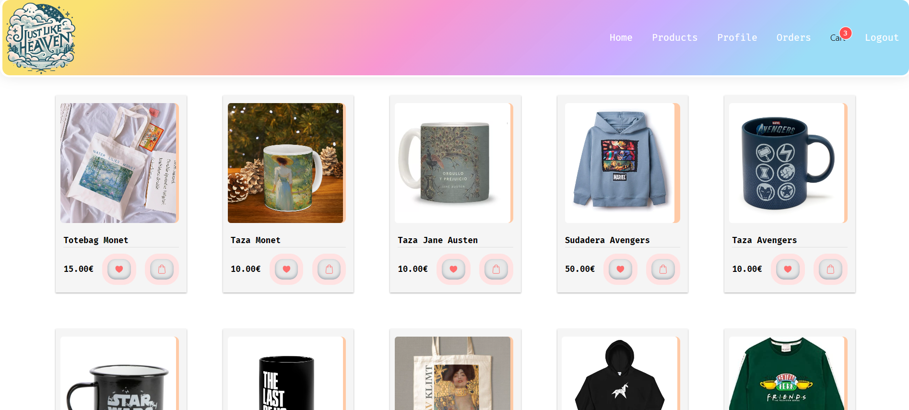
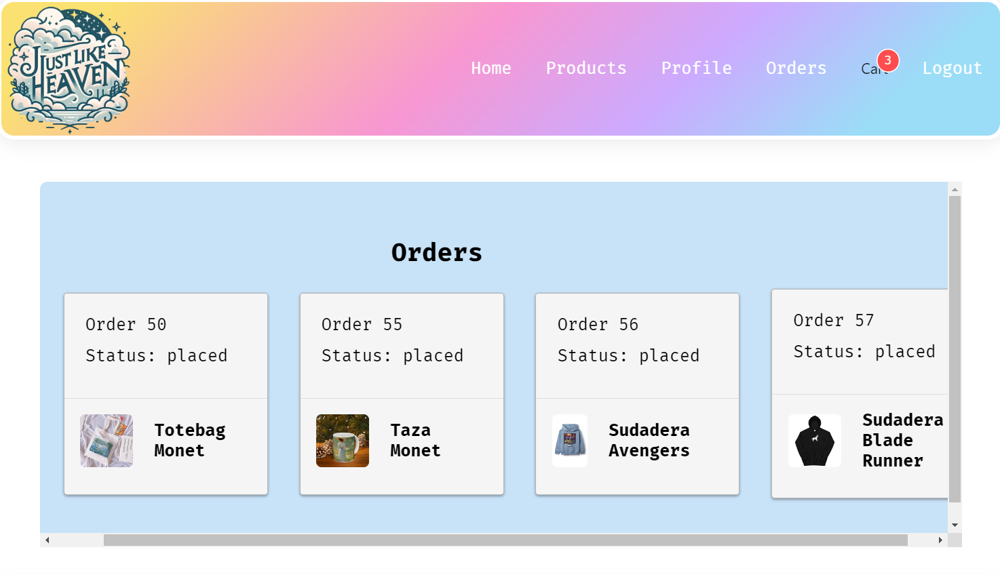
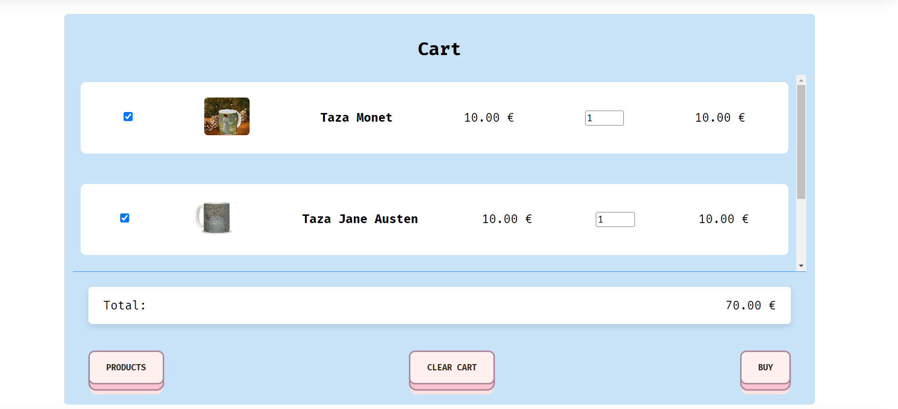
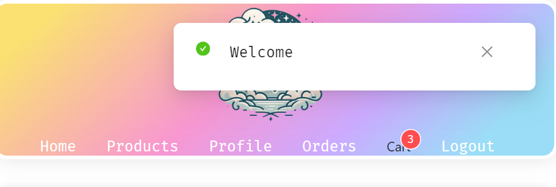

# Proyecto Frontend de Comercio Electrónico

Este es el frontend para una plataforma de comercio electrónico construida utilizando React, React Router y Context API. El backend para este proyecto también fue desarrollado por mí, utilizando Node.js, Sequelize y MySQL2.

## Tabla de Contenidos

-   [Introducción](#introducción)
-   [Diseño](#diseño)
-   [Características](#características)
-   [Instalación](#instalación)
-   [Uso](#uso)
-   [Paleta de Colores](#paleta-de-colores)
-   [Autor](#autor)
-   [Capturas de Pantalla](#capturas-de-pantalla)
-   [Repositorio del Backend](#repositorio-del-backend)

Este proyecto es una aplicación web de comercio electrónico que permite a los usuarios navegar por productos, agregarlos a su carrito y proceder al pago. La aplicación utiliza React para construir la interfaz de usuario, React Router para la navegación y Context API para la gestión del estado. Además, cuenta con componentes reutilizables que pueden ser utilizados en otros componentes, como el "HamsterSpinner", que se utiliza en varios lugares para mostrar un indicador de carga.

## Diseño

Hemos utilizado medidas relativas como `vh`, `vw`, `rem` y `%` para facilitar la responsividad de la aplicación. También hemos utilizado flexbox y media queries (`max-width`/`min-width`) cuando ha sido necesario para adaptar el diseño a diferentes tamaños de pantalla.

Además, hemos estructurado nuestros estilos de manera organizada. Tenemos un archivo `app.scss` donde hemos puesto los estilos que se reutilizarán en diferentes archivos para mantener un código limpio y modular. Además, hemos creado un archivo `Colors.scss` donde guardamos los colores utilizados en la aplicación para una gestión más centralizada y fácil de mantener.

## Características

-   Navegar por productos
-   Ver detalles del producto
-   Agregar productos al carrito
-   Ver resumen del carrito

## Instalación

Para instalar las dependencias del proyecto, ejecuta el siguiente comando en la raíz del proyecto:

```bash
npm install
```

## Uso

Para ejecutar el proyecto en modo de desarrollo, utiliza el siguiente comando:

```bash
npm start
```

## Paleta de Colores

A continuación se muestra una paleta de colores retro utilizada en el proyecto:

| Color      | Código  | Muestra                                                                                           |
| ---------- | ------- | ------------------------------------------------------------------------------------------------- |
| Azul cyan  | #96f0fa | <div style="width: 20px; height: 20px; background-color: #96f0fa; border: 1px solid #000;"></div> |
| Amarillo   | #FCFC8B | <div style="width: 20px; height: 20px; background-color: #FCFC8B; border: 1px solid #000;"></div> |
| Lila       | #F4C8ED | <div style="width: 20px; height: 20px; background-color: #F4C8ED; border: 1px solid #000;"></div> |
| Rosa Claro | #FFB6C1 | <div style="width: 20px; height: 20px; background-color: #FFB6C1; border: 1px solid #000;"></div> |

## Capturas de Pantalla

Aquí, se muestran algunas capturas de pantalla de la aplicación:

![Ejemplo de card signUp /login]


![Ejemplo de vista de productos]


![Ejemplo de vista de orders]


![Ejemplo de vista de cart]


![Ejemplo de vista de notificaciones]


## Repositorio del Backend

El backend de este proyecto ha sido desarrollado con Node.js y Sequelize. Puedes encontrar el código fuente del backend en el siguiente enlace:

https://github.com/DaniellaBarraza125/Proyecto-Backend

## Author💪🫀

-   [@DaniellaBarraza125](https://github.com/DaniellaBarraza125)
